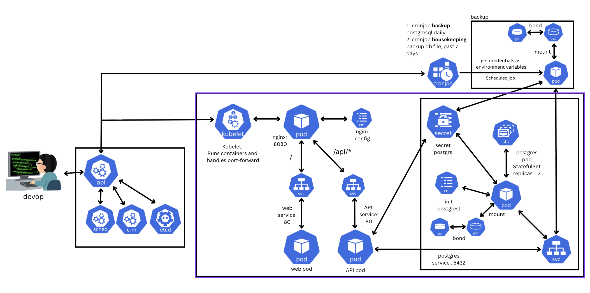

# Microservices K8s

Node.js frontend, Go API, NGINX gateway, and PostgreSQL on Kubernetes with Kustomize.

## Architecture



## Run locally

Start Docker Desktop (or Docker Engine on Linux). Run commands from the repository root.
Choose Kind or Minikube; Docker Desktop's built-in Kubernetes is not required.

### Kind

```bash
brew install kubectl kind # macOS, if needed
kind get clusters

# Create only if a cluster named "kind" does not exist
kind create cluster --name kind

bash scripts/kind.sh
kubectl --context=kind-kind -n demo-dev port-forward svc/nginx 3000:80
```

### Minikube

```bash
brew install kubectl minikube # macOS, if needed
bash scripts/minikube.sh
kubectl --context=microservices-k8s -n demo-dev port-forward svc/nginx 3000:80
```

Open **http://localhost:3000**. API: **http://localhost:3000/api/items**.
Keep port-forward running. Local access uses HTTP and needs no Ingress controller or ArgoCD.

Both scripts build and load images, deploy to `demo-dev`, and wait for readiness.
Rerun your setup script after code changes. Kind was verified locally;
Minikube is an alternative using 2 CPUs and 3 GiB of memory.

## Check the app

```bash
kubectl --context=kind-kind -n demo-dev get pods,pvc
curl --fail http://localhost:3000/api/items
```

For Minikube, use `--context=microservices-k8s`.
The API initially returns Item A, Item B, and Item C.

## Backups

The [backup manifest](k8s/base/postgres/postgres-backup.yaml) creates a separate
backup PVC and a CronJob scheduled for 02:00 Bangkok time. It is suspended by
default. Each run uses `pg_dump`, then removes completed backups older than
7 days. Test backup and restore before enabling the schedule.

## Stop or clean up

Press **Ctrl+C** to stop port-forward. To pause Minikube:

```bash
minikube stop -p microservices-k8s
```

To remove this app from Kind, including its database and backup volume claims/data:

```bash
kubectl --context=kind-kind delete namespace demo-dev
```

## Project files

| Path | Purpose |
|------|---------|
| `services/` | Application code and Dockerfiles |
| `k8s/base/` | Shared Kubernetes manifests |
| `k8s/overlays/` | Local, dev, dev-cnpg, staging, and prod configuration |
| `argocd/` | GitOps application definitions; separate from local setup |
| `scripts/` | Setup, cleanup, and diagram generation |

See the [setup and operations guide](docs/setup.md) for troubleshooting,
custom cluster names, ArgoCD configuration, and generated diagrams.
